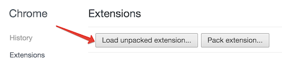

# Повозка с горячими клавишами для Atlassian JIRA
### Возможности
На данные момент доступны горячие клавиши (без возможности настройки) для следующих действий:
* Изменение состояния тикета
  * **s, w** — В работу (*work*)
  * **s, f** — Готово (*finish*)
  * **s, p** — Отложить (*postpone*)
  * **s, r** — Review (*review*), Откатить (*roll back*)
  * **s, o** — На доработку/Открыть снова (*open*)
  * **s, g** — Все хорошо (*good*)
  * **s, t** — Протестировать (*testing*)
  * **s, c** — Закрыть (*close*)
  * **s, b** — Есть баги (*bugs*)
  * **s, s** — Протестировано (*teSted*)
  * **s, d** — На боевом (*deployed*)
  
* **n** — Скопировать commit-message тикета

### Установка

Сейчас установка расширения возможно только через Dev-режим в Google Chrome.

```
cd PROJECT_PATH
git clone git@github.com:pmyagkov/jirabus.git jirabus
```

Далее загружаем расширение в Google Chrome и выбираем `PROJECT_PATH`:



Перезагружаем страницу с JIRA. Если все хорошо, то иконка расширения загорится жёлтым.
